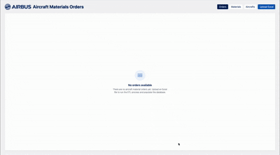
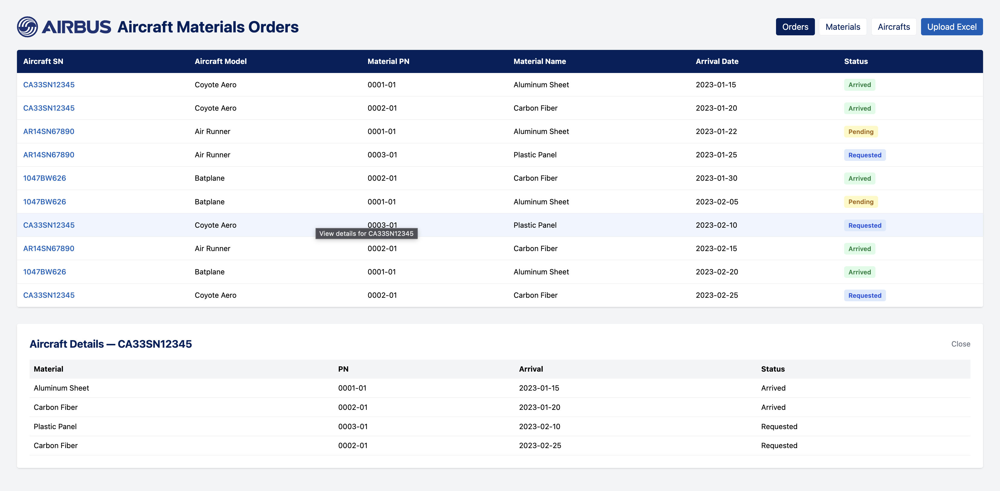
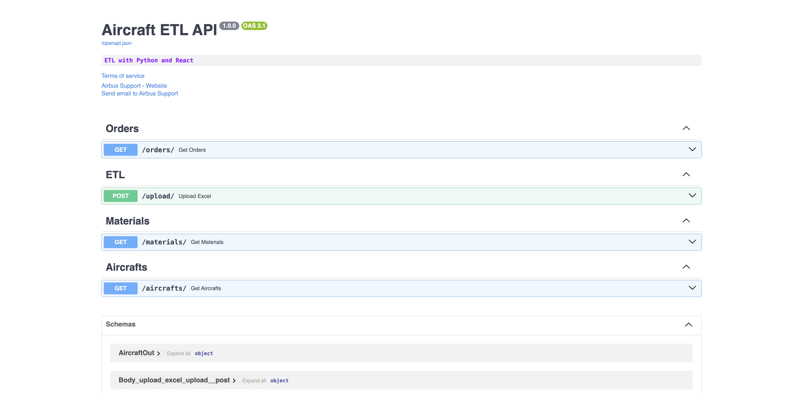

# Aircraft ETL System

A full-stack web application for managing aircraft, materials, and orders using ETL processes.



## Stack

### Backend

- **FastAPI**
- **SQLAlchemy**
- **Alembic**

### Frontend

- **React**
- **Vite**
- **Tailwind CSS**

### DevOps

- **Docker**
- **Docker Compose**
- **Nginx**



## Project Structure

```
rafa-tech-exercise/
├── backend/                 # FastAPI application
│   ├── app/
│   │   ├── main.py         # FastAPI app and routes
│   │   ├── models/         # Database models
│   │   ├── schemas/        # Pydantic schemas
│   │   ├── routes/         # API endpoints
│   │   ├── etl/            # ETL logic
│   │   ├── db/             # Database configuration
│   │   └── tests/          # Unit tests
│   ├── alembic/            # Database migrations
│   ├── dockerfile          # Backend container
│   └── requirements.txt     # Python dependencies
│
├── frontend/               # React application
│   ├── src/
│   │   ├── components/     # React components
│   │   ├── api/            # API client functions
│   │   ├── assets/         # Static assets
│   │   └── App.jsx         # Main component
│   ├── public/             # Public assets
│   ├── dockerfile          # Frontend container
│   ├── nginx.conf          # Nginx configuration
│   ├── package.json        # Node dependencies
│   ├── vite.config.js      # Vite configuration
│   └── tailwind.config.js  # Tailwind CSS config
│
├── docker-compose.yml      # Multi-container configuration
└── README.md              # This file
```

## Getting Started

### Installation

### Running with Docker

The easiest way to run the entire application:

```bash
docker-compose up --build
```

This will:

- Build and start the backend service on `http://localhost:8000`
- Build and start the frontend service on `http://localhost`

To stop the services:

```bash
docker-compose down
```

To view logs:

```bash
docker-compose logs -f
```

### Running Locally

#### Backend Setup

1. **Create and activate a Python virtual environment**

```bash
cd backend
python -m venv venv
source venv/bin/activate  # On Windows: venv\Scripts\activate
```

2. **Install dependencies**

```bash
pip install -r requirements.txt
```

3. **Migrate DB**

```bash
alembic upgrade head
```

4. **Run the application**

```bash
python -m app.main
```

The API will be available at `http://127.0.0.1:8000`

#### Frontend Setup

1. **Install dependencies**

```bash
cd frontend
npm install
```

2. **Start the development server**

```bash
npm run dev
```

The application will be available at `http://localhost:5173`

3. **Build for production**

```bash
npm run build
```

## API Documentation

Once the backend is running, interactive API documentation is available at:

- **Swagger UI**: http://localhost:8000/docs



### Database Migrations

Create a new migration:

```bash
cd backend
alembic revision --autogenerate -m "Description"
alembic upgrade head
```

### Running Tests

```bash
cd backend
pytest
```
